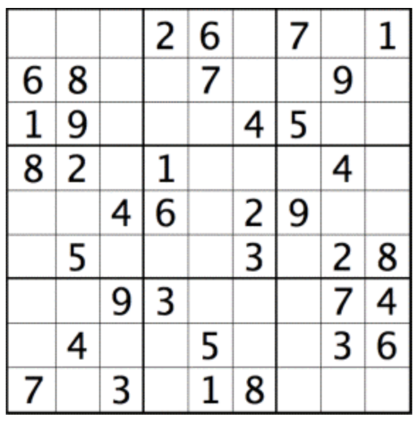
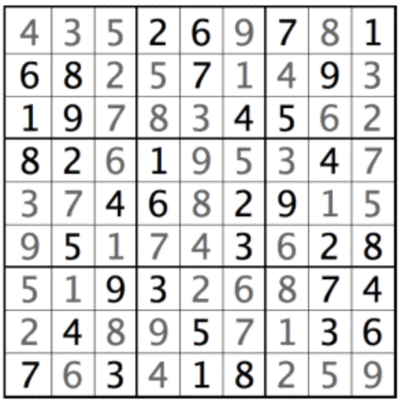

# chsharp_optimization

C# implementation of a Sudoku solver using Simulated Annealing, a probabilistic optimization algorithm. 

# Sudoku

Sudoku is a classic number puzzle game that involves filling a 9x9 grid with digits. The puzzle begins with some cells already filled with numbers, and the goal is to complete the grid following specific rules - every row, column and 3x3 block must contain unique digits from 1 to 9.

<!--  -->
Example of unsolved sudoku puzzle:

Solved sudoku:

<!--  -->

# Simulated annealing

Simulated Annealing is a probabilistic optimization algorithm inspired by the annealing process in metallurgy. It is often used to find near-optimal solutions to combinatorial optimization problems. Simulated Annealing is known for its ability to escape local optima and explore a broader solution space, making it suitable for complex optimization problems.

Simulated Annealing starts with an initial solution and iteratively explores neighboring solutions. It accepts better solutions with certainty but occasionally accepts worse solutions with a decreasing probability over time. The algorithm maintains a temperature parameter that controls the likelihood of accepting worse solutions. As the algorithm progresses, the temperature decreases, and the acceptance of worse solutions becomes less probable.

# Project Structure

- `compose.sh`: This script is a set of commands for the .NET CLI (Command-Line Interface) that automates the creation of a solution with multiple projects and sets up references between them.

- `sudoku_lib`: Contains the core Sudoku logic, including the board representation, operations for rows, columns, block and single cells such as calculation of errors(number of duplicate digits).

- `sudoku_optimization`: Implements the optimization algorithm Simulated Annealing. Contains logic responsible for generating new states for SA, evaluation of state, updating temperature value.

- `sudoku_cli`: A console application that utilizes the core Sudoku and optimization libraries to solve Sudoku puzzles using Simulated Annealing.

- `sudoku_test`: Project with unit tests to ensure the correctness of sudoku board representation and the SA algorithm.

# Simulated Annealing Performance: C# vs Rust

Measured using the Linux time command.

C# Implementation:

Execution time for 10 runs of SA with different seeds:

        81.09s user 2.45s system 101% cpu 1:22.19 total
Resulting in an average execution time of 8.109s for solving one sudoku.

Rust Implementation:

Execution time for 10 runs of SA with different seeds:

        54.38s user 0.85s system 103% cpu 53.223 total
Resulting in an average execution time of 5.438s for solving one sudoku, showcasing a 33% improvement.
